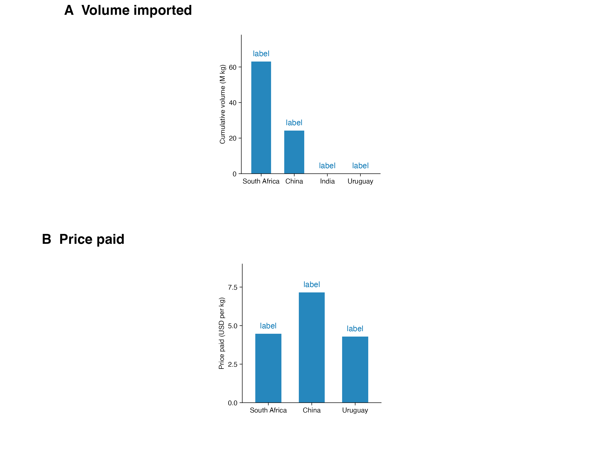
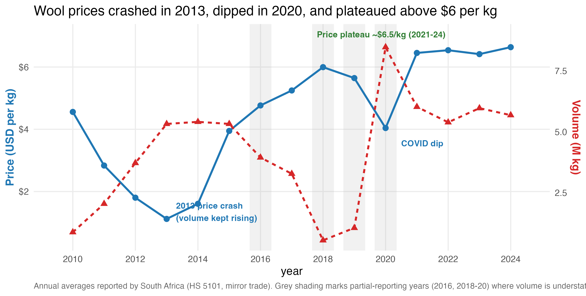

# Basotho Wool: Who Buys It, and What Drives Its Price

> A business-oriented TidyTuesday analysis (2026-08-04) of Lesotho's wool trade,
> using UN Comtrade mirror-trade data. Two questions at the heart of it: *who*
> really buys the wool — the gateway or the end consumer — and *what* moves the
> money — price or volume.

## Dataset

- **TidyTuesday** 2026-08-04, curated by [Ntobeko Sosibo](https://github.com/afrikaniz3d-za).
- **Original source:** [UN Comtrade Database](https://comtradeplus.un.org/) — monthly
  imports of Lesotho wool (HS 5101) recorded by reporting partners, 2010-2024.
- **Background:** *"The mountain men behind Lesotho's wool wealth"* by Sechaba
  Mokhethi, [GroundUp News](https://groundup.org.za/article/the-mountain-men-behind-lesothos-wool-wealth/).
- **Files:** `data/basotho_wool.csv`, `analysis.R`, `report.qmd`, `figures/`, `outputs/`.

## Business Questions

1. **Who really buys Basotho wool?** Is South Africa the true customer, or a
   *gateway* that funnels wool on to higher-value buyers like China?
2. **What drives the value of the trade?** Is revenue growth explained by price
   per kilogram, by volume exported, or by both?

## Methodology

- HS 5101 only (2 rows of waste wool dropped). Mirror-trade imports, USD.
- Value backbone: `primary_value`, falling back to `fobvalue` where China's primary
  value is missing (51/91 rows).
- Trend analysis uses the **South Africa** series — the only reporter with reliable
  monthly coverage. India's unit price is excluded (reporting artifact).
- Full pipeline in `analysis.R`; rendered report in `report.qmd`.

## Key Findings

### 1. South Africa is the gateway; China is the high-value destination



*Alt text: Two-panel bar chart. Top: cumulative volume imported (M kg) — South
Africa 63.1, China 24.2, India ~0, Uruguay ~0. Bottom: price paid (USD/kg) — China
7.16, South Africa 4.47, Uruguay 4.29. India is omitted from the price panel because
its unit price is a data artifact.*

South Africa takes **72% of volume (63.1 of 87.4 M kg)** at the **lowest price**
($4.47/kg); China takes 24.2 M kg at **$7.16/kg — about 60% more per kilo**. South
Africa is not the end market — wool is auctioned in **Port Elizabeth** before
re-export. The real demand signal lives in China and the auction floor.

### 2. Price, not volume, is the swing factor



*Alt text: Dual-axis line chart, 2010-2024. Blue line (left axis) shows price per
kg falling from $4.56 (2010) to a 2013 crash low of $1.12, recovering to ~$6 by
2017, dipping to $4.04 in COVID 2020, then plateauing at $6.4-6.6. Red triangles
(right axis) show volume rising from 0.88 M kg (2010) to ~5.3 M kg (2013) then
stabilising near 5-6 M kg. Grey shading marks partial-reporting years (2016,
2018-20).*

Volume grew six-fold to 2013 then went flat; the **2013 crash was a price event**.
Since then, **nearly all of the ~9x revenue growth ($4M → $38M) came from price
recovery**, not more wool. A price fall from $6.5 to $4 would erase ~$150M of
export value at current volumes.

## Recommendations

1. **Read the gateway correctly** — track China and Port Elizabeth auction prices,
   not just South African volumes; market on value-per-kg quality.
2. **Defend the price premium** — certification is the difference between $4.5 and
   $7/kg; protect the $6.5 plateau.
3. **Hedge the price cycle** — forward selling and auction-floor risk management
   stabilise herders' incomes against swings like 2013 and 2020.
4. **Harden the data** — China's primary value is 51% missing; consistent CIF/FOB
   conventions would improve comparisons.

## Reproducibility

```r
source("analysis.R")   # regenerates outputs/ and figures/
```

- `analysis.R` — cleaning, summary tables (`outputs/`), and both figures (`figures/`).
- `report.qmd` — the full rendered report (needs Quarto).
- Data: `data/basotho_wool.csv`.

## Data Credit

Dataset: TidyTuesday (2026-08-04). Original source: UN Comtrade Database. Article:
GroundUp News. This dataset is not my own; it is used under the TidyTuesday open-data
ethos. Alt text and figures are my own work.
