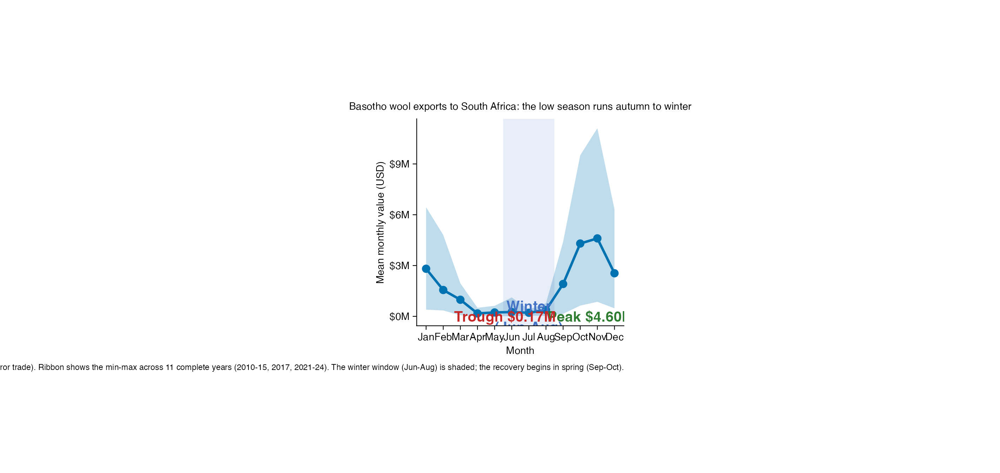
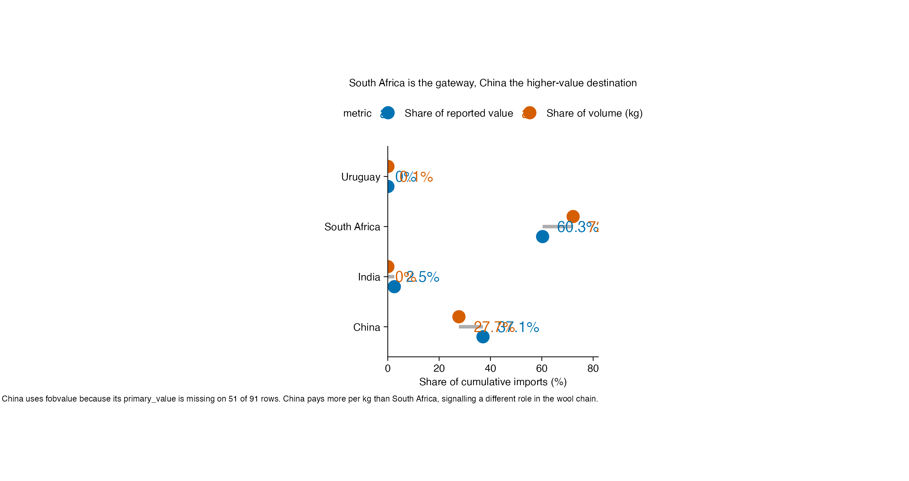
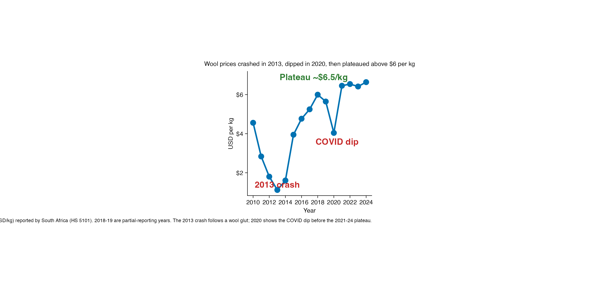

```{r setup, include=FALSE}
knitr::opts_chunk$set(fig.width = 9.5, fig.height = 4.5, out.width = "100%")
library(dplyr)
library(readr)
reporter_totals   <- read_csv("outputs/reporter_totals.csv", show_col_types = FALSE)
seasonal_profile  <- read_csv("outputs/seasonal_profile.csv", show_col_types = FALSE)
sa_price_trend    <- read_csv("outputs/sa_price_trend.csv", show_col_types = FALSE)
```

## Introduction

Lesotho is one of Africa's most livestock-dependent economies. When mining jobs in
South Africa declined, rural households returned to the land, and today **wool and
mohair are among the country's most valuable agricultural exports**. In the 2024-25
season alone, roughly **M800 million** entered the country through wool and mohair
sales (GroundUp News).

This report uses mirror trade statistics from the **UN Comtrade Database** (imports
of Lesotho wool reported by the importing countries) to answer three business
questions about the industry.

## Business Questions

1. **Seasonality** — When does Basotho wool export revenue trough and peak? Is the
   low season really *winter*, or does it start earlier?
2. **Top importer** — Is South Africa the true buyer of Basotho wool, or a *gateway*
   for higher-value demand from China?
3. **Trend** — How has the price per kilogram moved from 2010 to 2024?

## Data & Methodology

- **Source:** UN Comtrade Database (via `comtradr`), monthly records 2010-2024.
- **Commodity:** HS code 5101 "wool, not carded or combed" (291 rows; the 2 rows of
  HS 5103 waste wool were dropped).
- **Direction:** mirror trade — imports of Lesotho wool recorded by each reporting
  partner country.
- **Value backbone:** `primary_value` (complete for South Africa); where it is
  missing for China (51 of 91 rows) we fall back to `fobvalue`. Both measures are
  in USD. This choice is documented in `analysis.R`.

```{r coverage}
monthly_coverage <- read_csv("outputs/monthly_coverage.csv", show_col_types = FALSE)
monthly_coverage |>
  mutate(coverage = months_reported / 12) |>
  summarise(
    `Full years (12/12)` = sum(coverage == 1),
    `Median months/year` = round(median(months_reported), 1),
    .by = reporter_desc
  ) |>
  rename(`Reporter` = reporter_desc) |>
  arrange(desc(`Full years (12/12)`)) |>
  knitr::kable()
```

> **Data quality note.** Only **South Africa** reports all 12 months in most years.
> China and India have patchy coverage and Uruguay appears in just 2 rows. The
> seasonality analysis is therefore restricted to **South Africa on complete years**
> (2010-15, 2017, 2021-24), and the value analysis treats the reporters separately.
> No causal claims are made — these are mirror-trade aggregations.

## Finding 1 — The low season runs autumn to winter, not winter alone

```{r fig1}

```

*Alt text: Line and ribbon chart of the mean monthly value of Basotho wool imports
reported by South Africa across 11 complete years. The ribbon shows the year-to-year
range. Value is high in January ($2.8M), falls through autumn to a trough of about
$0.17M in April, stays below $0.4M through August (the shaded winter window), then
surges from September to a November peak of $4.6M before easing in December.*

### Observation

South African-reported import value follows a steep, repeatable seasonal curve:
**Jan $2.8M → Apr trough $0.2M → flat Apr-Aug → Oct-Nov peak $4.6M → Dec $2.5M.**

### Interpretation

The trough actually begins in **autumn (April)**, not winter. This matches the
industry calendar: wool is sheared in spring, gathered through the winter in the
highlands, and shipped down to the Port Elizabeth auctions in **spring and early
summer (Sep-Dec)** — the peak months. Winter (Jun-Aug) is the *tail* of the quiet
season, not the whole of it.

### Business Impact

Buyers and intermediaries face a cash-flow squeeze from **April to August**. Anyone
financing stock in that window — herders, traders, or wool-buying cooperatives —
needs working-capital support that the export receipts of Oct-Nov alone cannot
smooth.

## Finding 2 — South Africa is the gateway; China is the high-value destination

```{r fig2}

```

*Alt text: Dumbbell chart showing each importing country's share of cumulative
Basotho wool value versus share of volume. South Africa holds 60% of reported value
but 72% of volume; China holds 37% of value but 28% of volume, and pays about $7.16
per kg versus South Africa's $4.47. India and Uruguay are negligible.*

```{r table-totals}
reporter_totals |>
  mutate(
    `Value ($M)` = round(value_M, 1),
    `Volume (M kg)` = round(qty_Mkg, 1),
    `USD per kg` = round(price_per_kg, 2),
    `Value share` = paste0(round(value_share, 1), "%"),
    `Volume share` = paste0(round(qty_share, 1), "%")
  ) |>
  select(`Reporter` = reporter_desc, `Value ($M)`, `Volume (M kg)`,
         `USD per kg`, `Value share`, `Volume share`) |>
  knitr::kable()
```

### Observation

By reported value South Africa leads ($282M, 60%); by volume it is even more
dominant (63M kg, 72%). China is second on both (24M kg, 28% of volume) but pays a
**60% higher price per kg** ($7.16 vs $4.47).

### Interpretation

South Africa is not the end market — nearly all Lesotho wool is *tested and auctioned
in Port Elizabeth* before being re-exported. It is the **gateway** through which wool
flows out of Lesotho, so its "imports" are really the export channel. China, which
feeds the global wool-processing industry, takes a smaller volume but of **higher
value per kilogram** — consistent with it being the real destination for quality
mohair and wool.

> The India row ($424/kg) is a data artifact: India reported only 28,000 kg of
> quantity against $11.9M of value across scattered months, so its unit price is not
> economically meaningful and should be ignored.

### Business Impact

Chasing "South Africa" as the customer is a misread. For Lesotho's exporters the
actual demand signal lives in **China's buying behaviour and the Port Elizabeth
auction prices** — diversification and marketing strategy should target processors,
not the trans-shipment hub.

## Finding 3 — Prices crashed in 2013, recovered, and plateaued above $6/kg

```{r fig3}

```

*Alt text: Line chart of the annual average price of Basotho wool reported by South
Africa from 2010 to 2024. Price falls from about $4.6 to a 2013 crash low of $1.12,
recovers to about $6 by 2017, dips to $4.04 in the COVID year 2020, then plateaus
between $6.4 and $6.6 per kg through 2024. Export value grew from $4M in 2010 to
about $38M in 2024.*

```{r price-table}
sa_price_trend |>
  filter(year %in% c(2010, 2013, 2017, 2020, 2024)) |>
  mutate(
    `Price (USD/kg)` = round(price_per_kg, 2),
    `Value ($M)` = round(value_M, 1),
    `Months reported` = months_reported
  ) |>
  select(Year = year, `Price (USD/kg)`, `Value ($M)`, `Months reported`) |>
  knitr::kable()
```

### Observation

The price per kg fell from $4.56 (2010) to a **2013 low of $1.12**, recovered to
$5-6 in the late 2010s, dipped to **$4.04 in 2020 (COVID)**, then **plateaued at
$6.4-6.6 from 2021 to 2024**. Annual export value rose from $4M to ~$38M.

### Interpretation

The 2013 crash coincides with a global wool oversupply; the post-2020 plateau
reflects tight supply and firm demand for quality fibres. The near-decade recovery
means volume growth alone (63M kg today) plus better prices lifted total revenue
roughly **nine-fold** since 2010.

### Business Impact

Prices are the dominant lever on revenue — a fall from $6.5 to $4 per kg would erase
~$150M of export value at current volumes. Risk management (forward selling through
auction floors, quality certification to defend the price premium) matters as much as
growing volumes.

## Recommendations

1. **Smooth the cash cycle.** Structure financing for herders and traders around the
   **April-August trough** — auction receipts concentrate in Oct-Nov, so seasonal
   working-capital lines protect the supply chain in the quiet months.
2. **Track China, not just South Africa.** Monitor Chinese import volumes and
   Port Elizabeth auction prices as the leading demand indicators, and build
   marketing around **value-per-kg quality positioning** rather than tonnage.
3. **Defend the price premium.** Wool quality testing and certification (which
   already happens at Port Elizabeth) are the difference between $4.5 and $7/kg —
   invest in the quality pipeline and in branding to lock in the $6.5 plateau.
4. **Harden the data.** Non-South-Africa reporting is patchy (China's primary value
   is 51% missing). Pressing for better reporting and using consistent value
   conventions (CIF/FOB) would make cross-country comparisons more reliable.

## Reproducibility

- `analysis.R` — full pipeline: cleaning, summary tables, and all three figures.
- `outputs/*.csv` — coverage, reporter totals, seasonal profile, price trend.
- `figures/*.png` — the three charts above (also rendered inline).
- Data: `data/basotho_wool.csv` (UN Comtrade mirror trade, HS 5101).

Run everything with:

```{r repro, eval = FALSE}
source("analysis.R")   # regenerates outputs/ and figures/
```

## Data Credit

- **Dataset:** TidyTuesday (2026-08-04) — curated by Ntobeko Sosibo
  ([@afrikaniz3d-za](https://github.com/afrikaniz3d-za)).
- **Original source:** [UN Comtrade Database](https://comtradeplus.un.org/).
- **Background:** *"The mountain men behind Lesotho's wool wealth"* — Sechaba
  Mokhethi, [GroundUp News](https://groundup.org.za/article/the-mountain-men-behind-lesothos-wool-wealth/).
