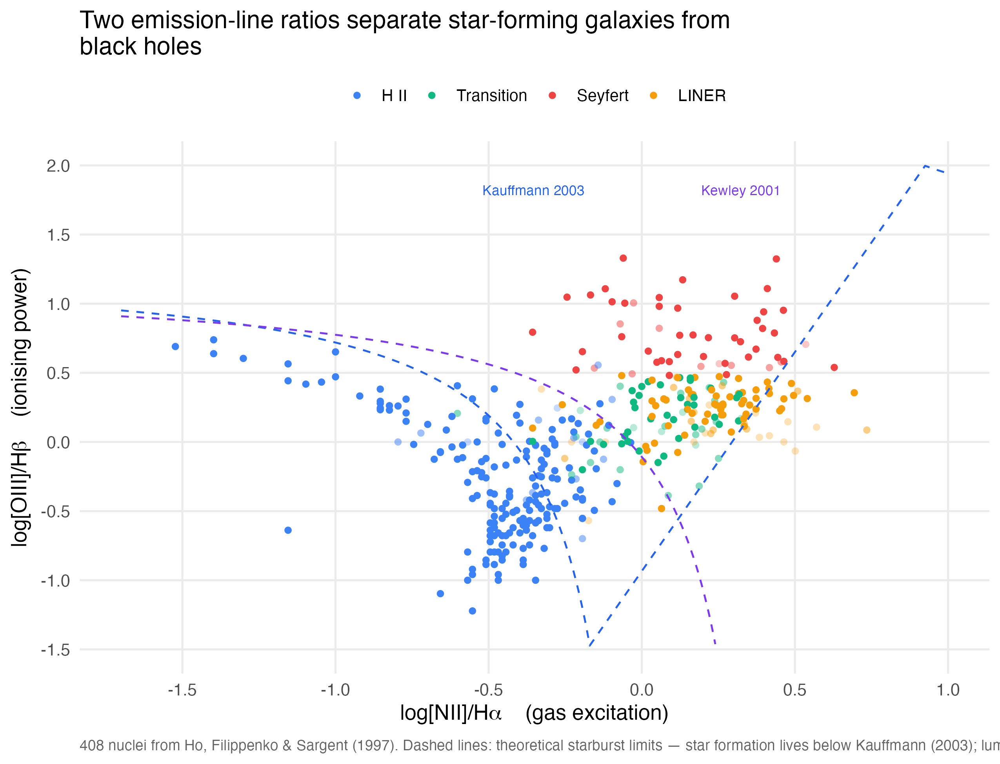
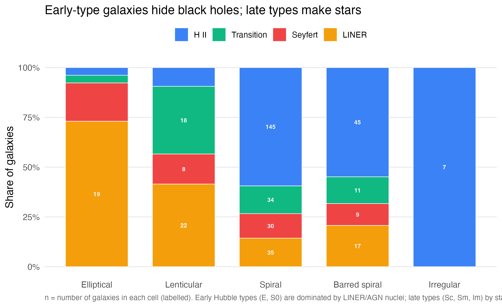
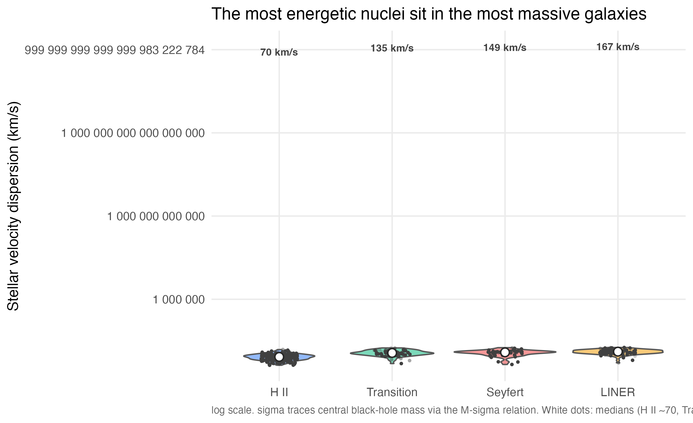

# Half of Nearby Galaxies Hide an Active Black Hole

> A TidyTuesday (2026-08-11) exploration of the **Palomar Spectroscopic Survey of Nearby Galaxies** (Ho, Filippenko & Sargent 1995/1997/2009) — 486 galaxy nuclei observed with the 200-inch Hale Telescope. Three questions, three visuals, one shared colour palette.

## The Three Questions

1. **Can two emission-line ratios separate star-forming galaxies from black holes?** — the classic [BPT diagram](https://ned.ipac.caltech.edu/level5/Glossary/Essay_bpt.html).
2. **Does galaxy shape predict what powers its centre?** — morphology vs. nuclear activity along the Hubble sequence.
3. **Do more massive galaxies host more active nuclei?** — velocity dispersion (M-sigma black-hole-mass proxy) vs. activity type.

## Key Findings

### 1. Two line ratios split star formation from black holes



*Alt text: BPT diagram, 406 nuclei. log[NII]/H-alpha (x) vs log[OIII]/H-beta (y), coloured by activity. Blue H II at lower left; red Seyferts upper right; orange LINERs to the right; green transitions between. Dashed Kauffmann/Kewley boundaries cut the plane; uncertain galaxies are faded.*

The ionising-power axis does the work: Seyferts sit at median log[OIII]/Hβ ≈ 0.75, H II at ≈ −0.31, LINERs to the right. Hard accretion-disk radiation vs. soft stellar light, separated by two dashed theoretical limits.

### 2. Shape predicts destiny



*Alt text: 100% stacked bars along the Hubble sequence (Elliptical, Lenticular, Spiral, Barred spiral, Irregular), segments coloured by activity type with counts labelled.*

| Morphology    | Dominant nucleus    | Share |
|:--------------|:--------------------|:------|
| Elliptical    | LINER (AGN)         | 73%   |
| Lenticular    | LINER / Transition  | 42% / 34% |
| Spiral        | H II (star-forming) | 59%   |
| Barred spiral | H II                | 55%   |
| Irregular     | H II                | 100%  |

Gas-poor early types host quiet AGN; gas-rich late types are star factories.

### 3. Bigger galaxies, busier black holes



*Alt text: violins of stellar velocity dispersion (log scale) by activity type (H II → Transition → Seyfert → LINER), medians marked at 70, 135, 149, 167 km/s.*

The M-sigma ladder is monotonic: star-forming nuclei in the lightest galaxies (σ ≈ 70 km/s), LINERs in the heaviest (σ ≈ 167 km/s), Seyferts between (≈ 149).

## Headline Numbers

- **~51%** of classified nuclei show some AGN signature (Seyfert + LINER + transition); **~49%** are pure star formation (H II).
- Census: H II 203 · LINER 94 · Seyfert 52 · Transition 65 · Absorption 1 (415 classified; 71 unclassified).
- 406 nuclei have complete line ratios for the BPT diagram.

## Methodology

- Source: Palomar survey via [VizieR](https://vizier.cds.unistra.fr/viz-bin/VizieR-2?-source=J/ApJS/112/315).
- **Data quirk handled:** the CSV's `log_*` columns are actually *linear* intensity ratios — `log10()` is applied in `analysis.R` before building the BPT diagram.
- Uncertainty: uncertain / very uncertain classifications are drawn faded (Figure 1).
- Full pipeline in `analysis.R`; rendered report in `report.qmd`.

## Reproducibility

``` r
source("analysis.R")   # regenerates outputs/ and figures/
```

- `analysis.R` — cleaning, morphology binning, figures, headline statistics.
- `outputs/` — `key_numbers.csv`, `hubble_strip.csv`.
- `figures/` — the three charts above.
- Data: `palomar_survey.csv`, `palomar_emission_lines.csv`.

## Data Credit

Dataset: TidyTuesday (2026-08-11), curated by [Tony Galvan, Golden Dome Data Science](https://github.com/gdatascience). Original source: Ho, Filippenko & Sargent ([ApJS 112, 315](https://arxiv.org/abs/astro-ph/9704108)) via VizieR. This dataset is not my own; it is used under the TidyTuesday open-data ethos. Figures and alt text are my own work.
