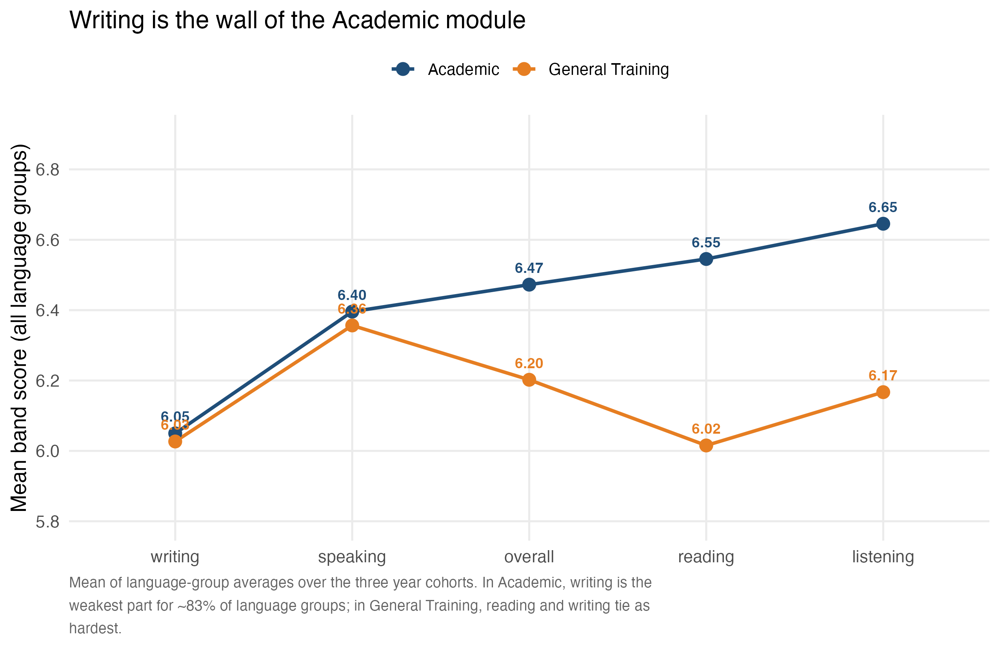
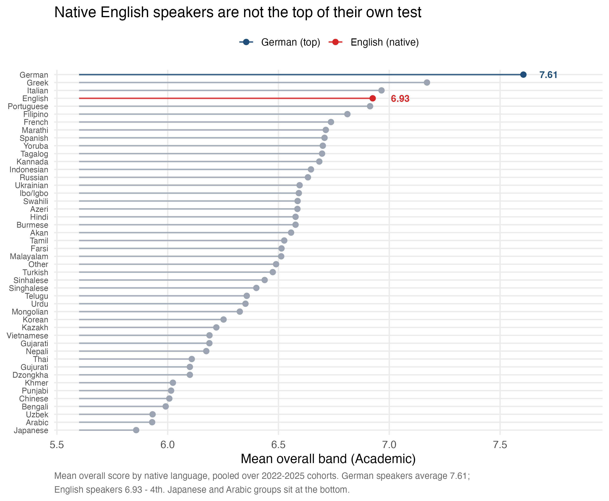
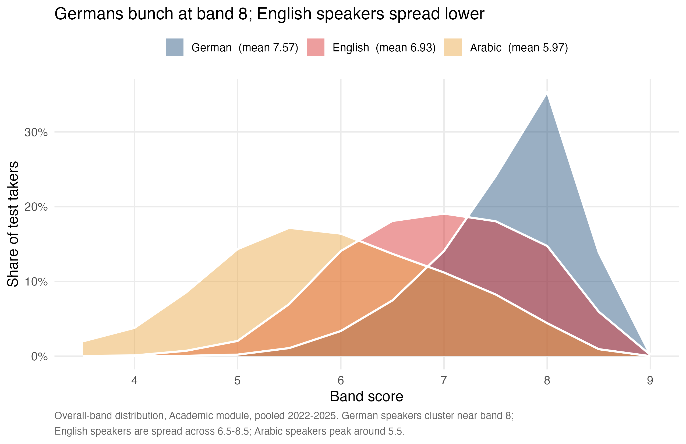
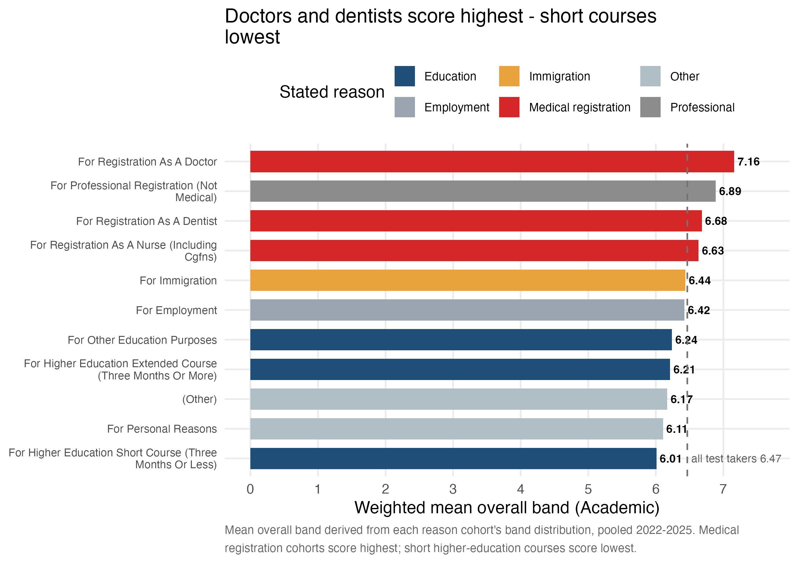

# Writing Is the Wall: Why Native Speakers Don't Top the IELTS

> A TidyTuesday (2026-08-18) exploration of **IELTS official test statistics** — band distributions and mean scores by language, nationality, and reason for taking the test, across the 2022–2025 Academic and General Training modules. Four questions, four visuals, one shared colour palette.

## The Four Questions

1. **Which part is hardest?** — Writing is the wall of the Academic module.
2. **Do native English speakers top their own test?** — No, they rank 4th.
3. **Why not?** — The band distributions tell the real story.
4. **Does the reason for sitting the test matter?** — Yes, a lot.

## Key Findings

### 1. Writing is the universal low point



*Alt text: mean band by test part for Academic (navy) and General Training (orange). Writing is lowest in Academic at 6.05; listening highest at 6.65. GT is flatter, with reading/writing tied at the bottom.*

Writing is the weakest skill for **~83%** of the 46 language groups in the data (Academic mean 6.05 vs listening 6.65). In General Training, reading (6.02) and writing (6.03) tie as hardest.

### 2. Native English speakers rank 4th



*Alt text: lollipop ranking of language groups by Academic overall band. German first at 7.61 (navy), English 4th at 6.93 (red), others grey; Japanese/Arabic at the bottom.*

| Rank | Language | Mean overall (Academic) |
|:----:|:---------|:-----------------------:|
| 1    | German   | **7.61** |
| 2    | Greek    | 7.17 |
| 3    | Italian  | 6.96 |
| 4    | English  | 6.93 |

German speakers average **0.7 of a band above native English speakers**. Selection effects (who sits the test and why) plus intensive test-prep ecosystems beat birthright on a standardized test.

### 3. Why: the distributions, not the averages



*Alt text: overlaid band distributions for German (navy), English (red), Arabic (amber). German peaks at band 8; English spreads across 6.5–8.5; Arabic peaks near 5.5.*

Germans bunch at band 8 (36% of takers, 60%+ at 7.5+); English speakers spread wide across 6.5–8.5; Arabic speakers peak around 5.5. The German–English gap is a whole-distribution shift, not an outlier.

### 4. Reason predicts score



*Alt text: horizontal bars of mean Academic overall band by reason. Medical registration (red) highest — doctors 7.16; education (navy) lowest — short courses 6.01. Dashed line: overall 6.47.*

Medical registration cohorts score highest (doctors **7.16**, dentists 6.68, nurses 6.63) — high-stakes pipelines with strict minimum bands. Higher-education applicants score lowest (short courses **6.01**).

## Headline Numbers

- Native speakers are **4th** (6.93); German speakers **1st** (7.61).
- Writing is the weakest part for **~83%** of language groups (Academic mean 6.05).
- Doctors' cohort scores **7.16** vs short-course students' **6.01** — a full band apart.
- Year-over-year is flat: Academic overall 6.45 → 6.51; no trend to chase.

## Methodology

- Source: [IELTS official test statistics](https://ielts.org/researchers/our-research/test-statistics), curated by [Elio Campitelli](https://github.com/eliocamp).
- **Data quirks handled:** the `percent` columns are *proportions* (0–1), not percentages; the duplicated "Ibo/lgbo" language is merged into "Ibo/Igbo"; the `<4` band is treated as 3.5.
- Mean scores are pooled across the 2022-23 / 2023-24 / 2024-25 cohorts where figures aggregate.
- Full pipeline in `analysis.R`; rendered report in `report.qmd`.

## Reproducibility

``` r
source("analysis.R")   # regenerates outputs/ and figures/
```

- `analysis.R` — loading, band conversion, Ibo merge, figures, headline statistics.
- `outputs/` — `key_numbers.csv`, `part_profiles.csv`, `language_ladder.csv`, `reason_scores.csv`.
- `figures/` — the four charts above.
- Data: `performance_by_*.csv`, `demo_by_*.csv`.

## Data Credit

Dataset: TidyTuesday (2026-08-18), curated by [Elio Campitelli](https://github.com/eliocamp). Original source: [IELTS official test statistics](https://ielts.org/researchers/our-research/test-statistics) (2022–2025 demographic and test-taker performance data). This dataset is not my own; it is used under the TidyTuesday open-data ethos. Figures and alt text are my own work.